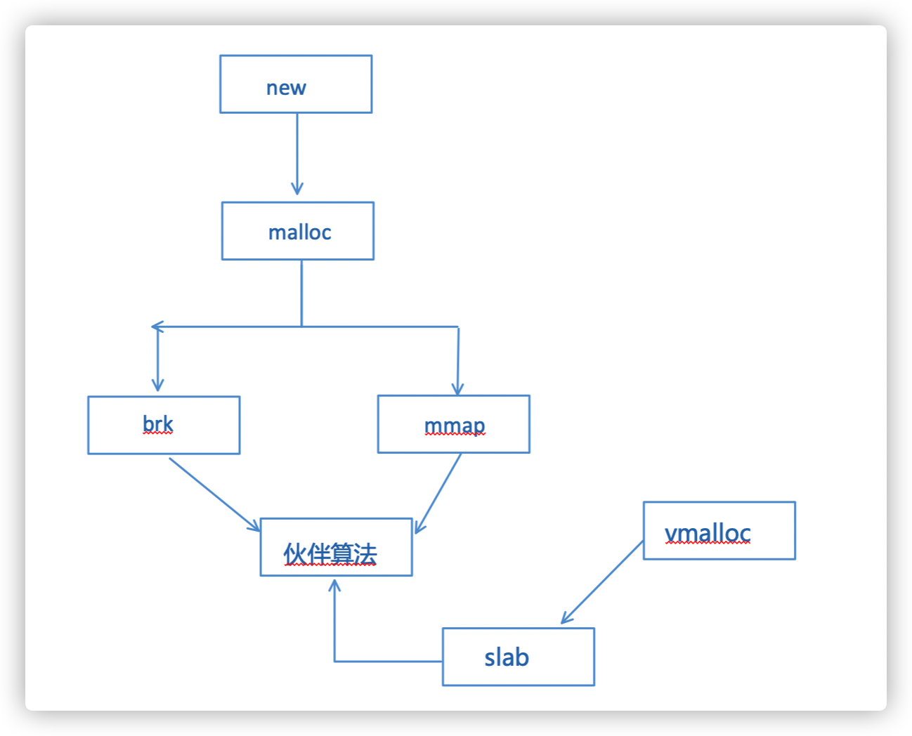
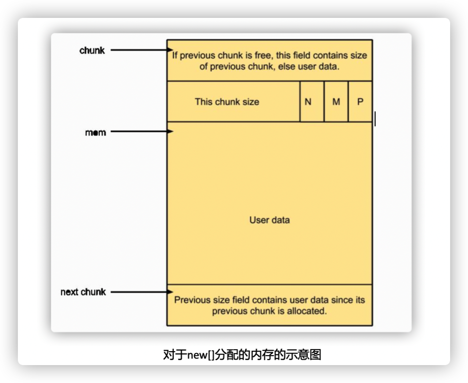
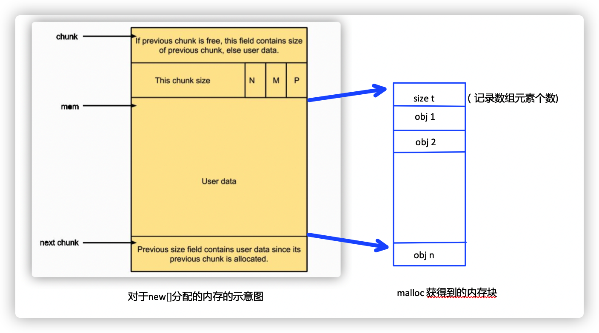
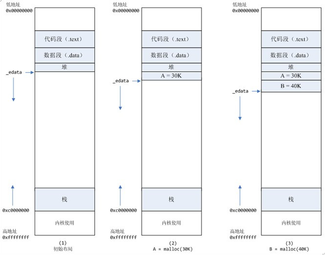
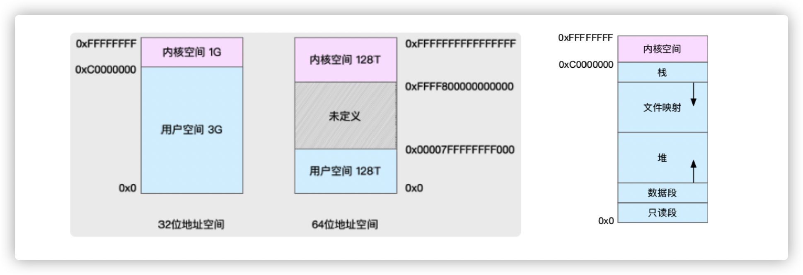

# c++ 的内存管理


### new和delete

* new 和 delete 做了什么？

    new:
    ```
    1. 申请内存
        new -> operator new -> malloc -> linux系统分配内存

    2. 在申请的内存上调用构造函数，构造对象
        new (raw_memory) Test();
    ```

    delete：
    ```
    1. 析构函数
    2. 释放对象
    ```

    new申请的内存来自于什么地方？
    

* new[] 和 delete[] 和 new ，delete的区别?

    **先把结论写在前面**，后面的问题就好理解了

    * new/malloc 会记录分配的内存的长度，delete/free 的时候无需指定长度，只要传入首地址即可。

    * 对于有 non-trivial destructor 的 class T, 现在通常的 C++ 实现会在 new[] 的时候多分配 sizeof(size_t) 字节用于保存数组大小，在 delete[] 的时候会依次逆序调用数组中各对象的析构函数。有的文献管这多分配的几个字节叫 new cookie (Itanium C++ ABI)。
    

1. 为什么申请内存的时候，需要带上size，而释放内存的时候不需要？

    在malloc申请内存的时候，在返回的指针上面会携带一个cookie的信息，信息中携带了内存这块内存的大小。所以，释放的时候，并不需要携带size。因为根据要释放内存的指针，就可以找到对应cookie信息，然后释放这块内存。

    

    https://www.zhihu.com/question/302440083

2. new[]申请的内存和new的行为是一样的吗？

    不一样，对于是new[]的的情况，会多申请一个size_t的内存，用来存储申请的数量。
    
    
    
    ```
    #include <iostream>
    //#include <iomanip>

    // 重载 c++的运算符号 
    void * operator new(std::size_t size)
    {
        void* k_buf =  malloc(size);
        std::cout << "size : "<< size <<", malloc : " <<  k_buf  << std::endl; 
        return k_buf;
    }

    void * operator new[](std::size_t size)
    {
        void * k_buf =  malloc(size);
        std::cout << "size : " << size <<", malloc[] : " <<  k_buf  <<std::endl; 
        return k_buf;
    }

    void operator delete(void * p)
    {
        std::cout<<"free "<< p <<std::endl; 
        free(p);
    }

    void operator delete [] (void * p)
    {
        std::cout<<"free[] "<< p <<std::endl; 
        free(p);
    }

    //定义一个简单的成员类 
    class Member
    {
    protected: 
        int  k_member1;

    public:
        Member() {k_member1 = 0;}
        ~Member() {}
    };

    int main()
    {
        int * p_int = new int[10];
        std::cout << "p_int addr : " << (void *)p_int << std::endl; 
        // delete [] p_int;
        delete p_int; 

        std::cout << "============" << std::endl;
        std::cout << "sizeof Member : " << sizeof(Member) << std::endl;
        std::cout << "sizeof size_t : " << sizeof(size_t) << std::endl;

        Member * member = new Member();
        std::cout << "member : " << member << std::endl; 
        delete member; 

        Member * member_array = new Member[5];
        std::cout << "member_array : " << member_array << std::endl; 
        // delete[] member_array;

        void * ptr = (void*)(member_array) - sizeof(size_t);
        std::cout << "ptr     : " << ptr <<std::endl; 
        int * get_num  = (int *)ptr;
        std::cout << "get num " << *get_num << std::endl;

        free(p);

        return 0;
    }

    ./a.out
    size : 40, malloc[] : 0x20cdeb0
    p_int addr : 0x20cdeb0
    free 0x20cdeb0
    ============
    sizeof Member : 4
    sizeof size_t : 8
    size : 4, malloc : 0x20ce2f0
    member : 0x20ce2f0
    free 0x20ce2f0
    size : 28, malloc[] : 0x20cdeb0    // 内存池分配的地址是 b0 
    member_array : 0x20cdeb8           // 数组的首位置地址是 b8  中间正好相差8个字节 == sizeof(size_t) new[] 像内存池多申请了一个size_t的长度，用于存放数组元素的长度
    get num 5                          // 正好是数组长度
    ptr     : 0x20cdeb0
    ```


    示例代码如下：
    ```
    // 用于分配内存的函数
    void* operator new(std::size_t size)
    {
        void* block = std::malloc(size);
        if (block == nullptr) {
            throw std::bad_alloc();
        }
        return block;
    }

    void* operator new[](std::size_t size)
    {
        void* block = std::malloc(size);
        if (block == nullptr) {
            throw std::bad_alloc();
        }
        return block;
    }

    // 用于释放内存的函数
    void operator delete(void* block) noexcept
    {
        std::free(block);
    }

    void operator delete[](void* block) noexcept
    {
        std::free(block);
    }

    // new T(args...)
    template <typename T, typename... Args>
    T* new_op(Args&&... args)
    {
        void* block = operator new(sizeof(T));
        // 在 block 这块内存上原地调用构造函数
        return new(block) T(std::forward<Args>(args)...);
    }

    // new T[size]()
    template <typename T>
    T* new_array_op(std::size_t size)
    {
        if constexpr (std::is_trivially_destructible_v<T>) {
            // 可平凡析构，无需记录大小。
            void* block = operator new[](sizeof(T) * size);
            T* p = reinterpret_cast<T*>(block);
            // 依次调用默认构造函数。
            for (std::size_t i = 0; i < size; ++i) {
                new(p + i) T();
            }
            return p;
        } else {
            // 不可平凡析构，需要记录大小。
            void* block = operator new[](sizeof(T) * size + sizeof(size_t));
            *reinterpret_cast<size_t*>(block) = size;
            T* p = reinterpret_cast<T*>(
                    reinterpret_cast<char*>(block) + sizeof(size_t));
            // 依次调用默认构造函数。
            for (std::size_t i = 0; i < size; ++i) {
                new(p + i) T();
            }
            return p;
        }
    }

    // delete ptr
    template <typename T>
    void delete_op(T* ptr) noexcept(std::is_nothrow_destructible_v<T>)
    {
        if (ptr != nullptr) {
            ptr->~T();
            operator delete(ptr);
        }
    }

    // delete[] ptr
    template <typename T>
    void delete_array_op(T* ptr) noexcept(std::is_nothrow_destructible_v<T>)
    {
        if (ptr == nullptr) {
            return;
        }
        if constexpr (std::is_trivially_destructible_v<T>) {
            // 可平凡析构，直接释放内存。
            operator delete[](ptr);
        } else {
            // 需要先获取数组大小。
            void* block = reinterpret_cast<char*>(ptr) - sizeof(size_t);
            size_t size = *reinterpret_cast<const size_t*>(block);
            // 然后依次调用析构函数。
            for (std::size_t i = 0; i < size; ++i) {
                (ptr + i)->~T();
            }
            // 最后释放内存。
            operator delete[](block);
        }
    }
    ```

3. 如果申请内存内存和释放的new和delete不匹配，会怎么样？

    分为两种情况，比如class T 没有析构函数（或者class T 是内置的成员变量）那么，使用错误没有太大影响。
    如果class T有析构函数，那程序会coredump掉。
    ```
    class inner 
    {
    public:
        inner() { cout << "inner Constructing " << hex << this << endl; }
        ~inner() { cout << "inner Destructing" << endl; }
    private:
        int val;
    };

    class normal
    {
    public:
        normal() { cout << "normal Constructing " << hex << this << endl; }
    private:
        int val;    
    };

    int main(int argc, char *argv[]) 
    {
        inner *  pa = new inner[2];
        normal * pb = new normal[2];
        int * pc = new int[2];

        delete pc;
        delete pb;   
        delete pa;  // coredump heres
        return 0;
    }

    /a.out 
    inner Constructing 0x210ceb8
    inner Constructing 0x210cebc
    normal Constructing 0x210d2e0
    normal Constructing 0x210d2e4
    inner Destructing
    munmap_chunk(): invalid pointer
    Aborted (core dumped)
    ```

* new 和 delete的重载

    operator new 和 opertor delete 分为两种重载，分别是全局的重载和类内部的重载。

    其他的部分整理在这里：

    https://www.jianshu.com/p/27e2a80a158c

* placement new

    ```
    class TEST
    {
    private:
        int val;
    public:
        TEST(int value)
        {
            this->val = value;
        }
        void print()
        {
            cout<<this->val<<endl;
        }
    };

    int main()
    {
        //TEST test[10];   //报错，因为没有默认无参数的的构造参数
        
        
        //使用placement new 
        int val = 998;
        
        // 分配空间
        void * raw_memory = operator new(sizeof(TEST) * 10);
        // 强转指针类型
        TEST * test = static_cast<TEST *>(raw_memory);
        // placement new
        for(int i=0;i<10;i++)
        {
        new(test+i) TEST(val);
        }

        // visit
        for(int i=0;i<10;i++)
        {
            (test+i)->print();
        }

        return 0;
    }
    ```

* delete 的时候 我觉得这样安全一点

    ```
    delete obj;
    obj = NULL;   # 让指针指空
    ```

### brk 和 mmap的区别

内存分配通过两个系统调用完成，分别是brk 和 mmap。判断的标准是如果小于128k的话，会通过brk分配，大于的话走mmap。


brk分配的内存需要等到高地址内存释放以后才能释放（例如，在B释放之前，A是不可能释放的，这就是内存碎片产生的原因，什么时候紧缩看下面），而mmap分配的内存可以单独释放。比如当前释放内存块A，当A释放时候，堆顶指针并不能收缩。只有当内存块B也释放的时候，data指针参会收缩。



当通过brk申请到内存之后，修改edata指针之后，并不会真的分配内存，直到访问这块内存的时候，才会出发缺页中断。

http://abcdxyzk.github.io/blog/2015/08/05/kernel-mm-malloc/


#### 进程的内存空间
附图一张 




#### 其他

关于内存管理，除了了解内存的基本原理，还有整理了一些其他的东西，

比如：C++不用工具，如何检测内存泄漏？

https://www.jianshu.com/p/27e2a80a158c

基于LD_PRELOAD的动态库函数hook
https://www.jianshu.com/p/c2c6644a7380

jemalloc内存profile
https://www.jianshu.com/p/4f9689ffca2d

---
### 参考

1. https://www.zhihu.com/question/406164583/answer/2040289707

2. new和delete以及new[]和delete[]一定要配对使用吗 - 程序喵大人的文章 - 知乎
https://zhuanlan.zhihu.com/p/144600712

3. 关于malloc返回值的问题？ - 程序喵大人的回答 - 知乎
https://www.zhihu.com/question/275695474/answer/1648135150

4. https://wetest.qq.com/lab/view/318.html

5. C++的new操作符，底层使用的是malloc吗，在析构时，是如何确定自己需要释放内存的大小的？ 作者：yuantj

    链接：https://www.zhihu.com/question/406164583/answer/2040289707

6. 关于vm和brk系统的分析：

    https://blog.holbertonschool.com/hack-the-virtual-memory-malloc-the-heap-the-program-break/


    https://mp.weixin.qq.com/s/3bXAGR_7XLX21nkdl9dQ8Q

7. 作者：yuantj
       链接：https://www.zhihu.com/question/406164583/answer/2040289707
       
8. https://www.zhangjiee.com/blog/2013/analyse-new-delete-malloc-free.html