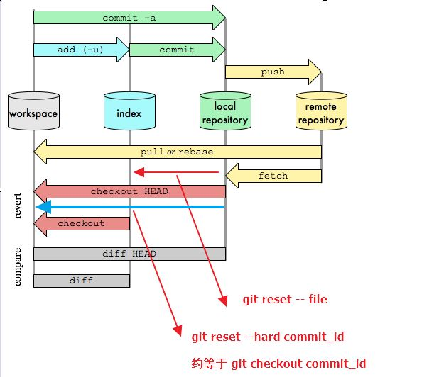
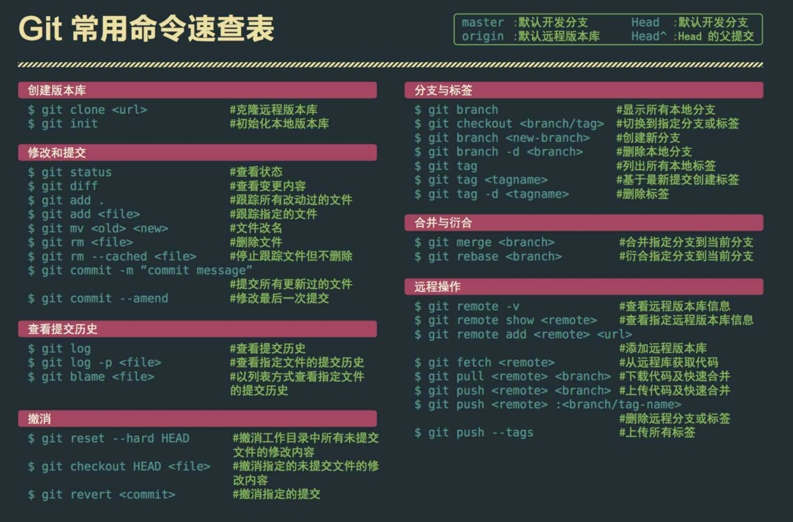

# Git 

## Git VS SVN

1. Git 属于分布式版本控制系统，而 SVN 属于集中式。

2. 集中式版本控制只有中心服务器拥有一份代码，而分布式版本控制每个人的电脑上就有一份完整的代码。

3. 集中式版本控制有安全性问题，当中心服务器挂了所有人都没办法工作了。

4. 集中式版本控制需要连网才能工作，如果网速过慢，那么提交一个文件的会慢的无法让人忍受。而分布式版本控制不需要连网就能工作。

5. 分布式版本控制新建分支、合并分支操作速度非常快，而集中式版本控制新建一个分支相当于复制一份完整代码。

6. 中心服务器用来交换每个用户的修改，没有中心服务器也能工作，但是中心服务器能够 24 小时保持开机状态，这样就能更方便的交换修改。**Github 就是一个中心服务器。**

---

## Git

Git 里面又三个概念：分别是工作区，暂存区，和版本库。

1. 工作区：就是你在电脑里能看到的目录。

2. 暂存区：英文叫stage, 或index。一般存放在 ".git目录下" 下的index文件（.git/index）中，所以我们把暂存区有时也叫作索引（index）。

3. 版本库：工作区有一个隐藏目录.git，这个不算工作区，而是Git的版本库。


下面这个图展示了工作区、版本库中的暂存区和版本库之间的关系：


---

提交的流程是比较简答的，整理一下**回滚的流程**。

搞明白要回滚的内容处于哪个状态。

1. 修改后 未git add

    * git checkout -- file         // 回滚单个文件

    * git checkout .               // 回滚全部

2. 修改后 git add，未commit

    * git reset HEAD file   (省略head也是可以的 git reset file)

        // 回滚单个文件
        
        // 这里的回滚流 指的是从版本库用head版本去覆盖stage区

        // 对于这个文件的内容，它是没有变化的，只是文件的状态改变了（相当于去掉 git add状态）
        
        // 如果想回滚文件的内容，那么再次使用git checkout -- file

    * git reset HEAD .    (省略head也是可以的  git reset .)

        // 回滚全部

        // 这里的回滚流 指的是从版本库用head版本去覆盖stage区

3. 修改后 git add，commit

    * reset 回滚：

        git reset commit-id --hard

        git reflog 

        // 查看回滚commit-id

    * revert 回滚：

        // 回滚会变成一次提交

        git reset commit-id 

---------

### 查看
```
git status
git status -s
git log
git log --stat
git reflog
```
---

### 分支管理

查看分支：
```
git branch
  dev
* master
```

创建分支：
```
git branch dev
```

切换分支：
```
git checkout dev
```

创建并且切换分支：
```
git checkout -b dev
```

合并分支：

```
# 如果要在master分支合并dev分支，那么在切换到master的分支之后，就可以合并dev分支
git merge dev
```

删除分支：
```
git branch -d (branchname)
```
----
### git diff

用git diff来找你当前工作目录和上次提交与本地索引间的差异。
```
git diff （diff 本地和暂存区）
git diff HEAD (diff 暂存区和版本库)
git diff dir  (仅对比某个目录下的diff)

查看某次提交的改动细节
git show 0b7454290bea
```

---

### .gitignore

首先，在你的工作区新建一个名称为.gitignore的文件。
**然后，把要忽略的文件名填进去，Git就会自动忽略这些文件。**

不需要从头写.gitignore文件，GitHub已经为我们准备了各种配置文件，只需要组合一下就可以使用了。
所有配置文件可以直接在线浏览：https://github.com/github/gitignore

比如说，不想把a.out文件加入git,那么在.gitignore的文件里面的内容是：
```
*.o
*.out
```

-------

### git的工具
```
# 很漂亮的图形的显示项目的历史
* sourcetree
```

### git配置

* zsh 不卡顿
```
git config --add oh-my-zsh.hide-dirty 1
git config --add oh-my-zsh.hide-status 1
```

* 不需要输入密码
```
git config --global user.email "you@example.com"
git config --global user.name "Your Name"
git config credential.helper store
```

-------

### rebase

rebase常用来做两个事情，一个是`rebase master`这种操作;一个是重写提交记录这种操作;

* rebase master

    https://waynerv.com/posts/git-rebase-intro/

    `git rebase master` 简单的讲，就是把在master的改动移动到新的分支上，然后再把在这个分支上提交的内容追加到后面。

    ```
    在开发过程中使用 git rebase 还是 git merge，优缺点分别是什么？ - 民工哥的回答 - 知乎
    https://www.zhihu.com/question/36509119/answer/2009073898
    ```

* 重写提交记录

    在rebase前，可以先确认一下git默认的编辑器是不是vim，如果不是的话，可以先改为vim
    git config --global core.editor "vim"

    `git rebase -i HEAD~~`  把最近的2条记录合并，这个时候会进入到一个新的界面
    `git rebase -i HEAD~3`  把最近的3条记录合并
    `git rebase -i cf7e875`  合并这个版本之前的提交（不包含这个版本）
    ```
    pick c7f5204 [dev](update main.cpp)
    pick 4c66629 update main.cpp

    # Rebase 92037d5..4c66629 onto 92037d5 (2 commands)
    #
    # Commands:
    # p, pick = use commit
    # r, reword = use commit, but edit the commit message
    # e, edit = use commit, but stop for amending
    # s, squash = use commit, but meld into previous commit
    # f, fixup = like "squash", but discard this commit's log message
    # x, exec = run command (the rest of the line) using shell
    # d, drop = remove commit
    #
    # These lines can be re-ordered; they are executed from top to bottom.
    #
    # If you remove a line here THAT COMMIT WILL BE LOST.
    #
    # However, if you remove everything, the rebase will be aborted.
    #
    # Note that empty commits are commented out
    ```

    把第二条改为
    ```
    pick c7f5204 [dev](update main.cpp)
    s 4c66629 update main.cpp
    ```

    然后查看一下，多条记录已经合并了。
----

## git分支开发流程

```
# 创建一个新的分支dev
git branch dev

# 切换到这个分支
git checkout dev 

# 推送这个分支到远端
git push origin dev:dev

# 开工写代码
# balalalala 

# 写完了 提交
# git add .
# git commit -m "xxxx"

# 需要推送到远端的话
git push origin dev

# 大功告成开发完毕
# 切回 master 分支，拉取 master 的最新代码

# 切回开发分支（反向合并master）
git rebase master (后面要处理一些冲突)

# 解决冲突的办法
修改提示冲突的文件，git add xxx  // 标记已解决冲突
git rebase --continue // 继续执行

# 切换到master分支
# 把dev分支的内容合并到master上
git merge dev

# 删除分支dev
git branch -d dev    git删除本地分支
git push origin --delete branch    git删除远程分支
```

# git tag
```
# 查看标签
git tag 

# 创建标签 (轻量标签)
git tag v0.1

# 创建附注标签
git tag -a v0.2 -m "my version 0.2"

# 查看细节
git show v0.1

# 共享标签
git push origin v1.5
git push origin --tags  # 推送所有的标签

# 删除标签
git tag -d v1.4-lw

```

## 参考

- [廖雪峰教程](https://www.liaoxuefeng.com/wiki/0013739516305929606dd18361248578c67b8067c8c017b000)

- [cyc_git教程](https://github.com/CyC2018/CS-Notes/blob/master/docs/notes/Git.md)

- [runoob教程](http://www.runoob.com/git/git-workspace-index-repo.html)

- [具体的每一个git命令的使用](https://www.yiibai.com/git/git_diff.html)

  https://gist.github.com/285571052/72fe4e85290d170b9de4634b6ad8c082

  https://git-scm.com/book/zh/v2

- [关于远程仓库](https://www.jianshu.com/p/9685a56bdf7a)

更新一部分：


